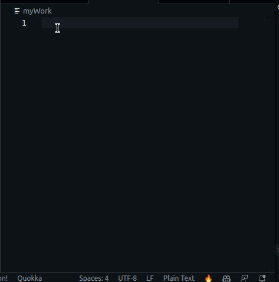

# Timey Wimey - the simple solution to time tracking

Timey Wimey is a VSCode extension that automatically tracks time spent coding per user per project.

## Features
Timey Wimey looks for user input. Whenever they start typing, 
timey will record that into `.vscode/timeyWimey/[userName].txt` with 
a UTX time stamp. If the user doesn't make any edits or saves for 
a set amount of minutes (by default 1), they will be concidered 
inactive and the time get's recorded.

An icon in the bottom right shows the current activity status and if clicked on
will generate time stats: number of hours worked on this project per user over 
today, this week, this month and last month. Via the command pallette you can 
also list time you spent on all of your tracked projects.

## Extension settings:
- inactivityInterval: number of minutes after which the user is concidered. Defaults 
to 1 minute.
- sessionActiveInterval: number of minutes after which it will be recorded (for 
the possibility of crash) that the user is indeed still working. Defaults to 5 minutes
- includeInGitIgnore: whether to include this user's file in the `.gitignore` file. 
Not everyone has to know how much you work. Defaults to true

